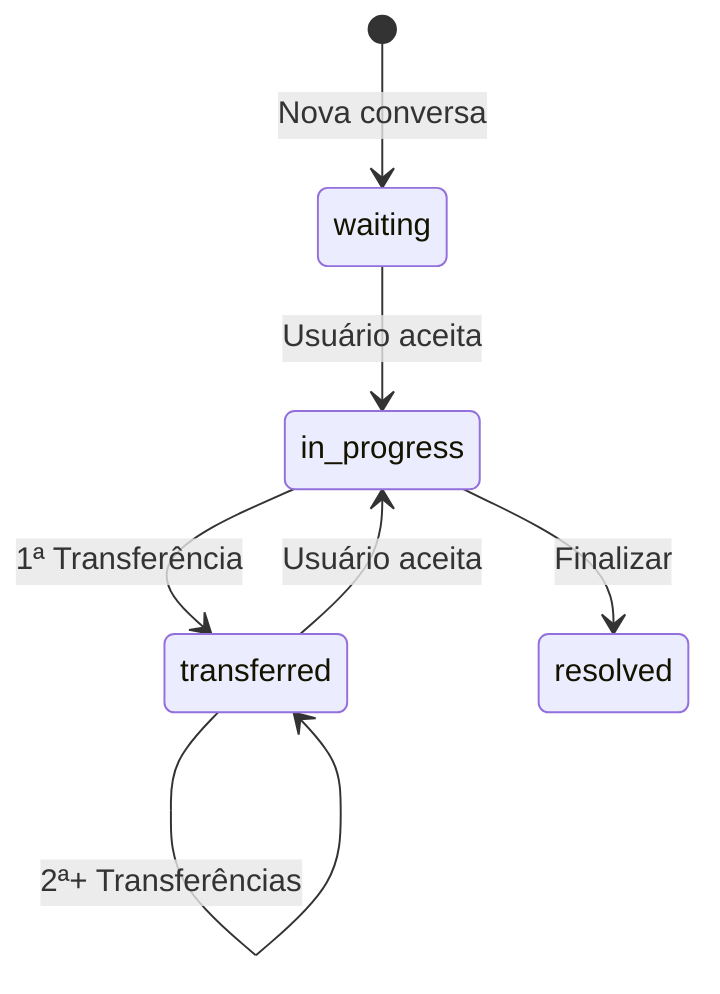

# 🔧 Correção: Erro na Segunda Transferência de Conversa

## 🐛 **PROBLEMA IDENTIFICADO**

Quando uma conversa era transferida pela **primeira vez**, funcionava perfeitamente. Porém, ao tentar transferir **novamente** (segunda transferência), o sistema retornava um erro de permissão.

### **Cenário do Bug:**

1. ✅ **Primeira transferência:** Setor A → Setor B (FUNCIONA)
2. ❌ **Segunda transferência:** Setor B → Setor A (ERRO!)

---

## 🔍 **CAUSA RAIZ**

### **O que acontecia:**

**Arquivo:** `backend/src/services/conversation.service.ts` (linhas 289-304)

```typescript
// ❌ CÓDIGO ANTIGO (COM BUG)
if (!isAdmin) {
  const userDepartmentIds = user?.departmentAccess.map((d: any) => d.departmentId) || [];
  const canTransfer = 
    conversation.assignedUserId === fromUserId ||
    (conversation.status === 'waiting' &&  // ⚠️ Só permitia "waiting"
     conversation.departmentId && 
     userDepartmentIds.includes(conversation.departmentId));

  if (!canTransfer) {
    throw new ForbiddenError('You can only transfer conversations assigned to you or in your department queue');
  }
}
```

### **Por que dava erro:**

| Tentativa | Status da Conversa | assignedUserId | Resultado |
|-----------|-------------------|----------------|-----------|
| 1ª Transferência | `in_progress` | UsuárioA | ✅ OK (conversa atribuída ao usuário) |
| Após 1ª Transferência | `transferred` | `null` | - |
| 2ª Transferência | `transferred` | `null` | ❌ ERRO! |

**Explicação:**
- Na **2ª transferência**, a conversa estava com status `transferred` (não `waiting`)
- A validação só permitia transferir conversas com status `waiting` OU atribuídas ao usuário
- Como estava `transferred` e sem `assignedUserId`, o sistema negava a permissão! ❌

---

## ✅ **SOLUÇÃO IMPLEMENTADA**

### **Correção Aplicada:**

**Arquivo:** `backend/src/services/conversation.service.ts`

```typescript
// ✅ CÓDIGO CORRIGIDO
if (!isAdmin) {
  const userDepartmentIds = user?.departmentAccess.map((d: any) => d.departmentId) || [];
  const canTransfer = 
    conversation.assignedUserId === fromUserId ||
    ((conversation.status === 'waiting' || conversation.status === 'transferred') &&  // ✅ Agora aceita "transferred" também!
     conversation.departmentId && 
     userDepartmentIds.includes(conversation.departmentId));

  if (!canTransfer) {
    throw new ForbiddenError('You can only transfer conversations assigned to you or in your department queue');
  }
}
```

### **O que mudou:**

```diff
- (conversation.status === 'waiting' && 
+ ((conversation.status === 'waiting' || conversation.status === 'transferred') && 
```

Agora usuários podem transferir conversas que:
1. ✅ Estão atribuídas a eles
2. ✅ Estão com status `waiting` no seu departamento
3. ✅ **Estão com status `transferred` no seu departamento** ← **NOVO!**

---

## 🎯 **RESULTADO**

### **Antes (com bug):**
```
Transferência #1: Setor A → Setor B ✅
Transferência #2: Setor B → Setor A ❌ ERRO: "You can only transfer conversations assigned to you..."
```

### **Depois (corrigido):**
```
Transferência #1: Setor A → Setor B ✅
Transferência #2: Setor B → Setor A ✅
Transferência #3: Setor A → Setor B ✅
Transferência #N: Funciona infinitamente! ✅
```

---

## 🧪 **COMO TESTAR**

### **Teste Manual:**

1. **Faça login** como usuário não-admin
2. **Aceite uma conversa** do Setor A
3. **Transfira** para Setor B
   - Resultado esperado: ✅ Sucesso
4. **Vá para o Setor B** (ou faça login com usuário do Setor B)
5. **Transfira de volta** para Setor A
   - Resultado esperado: ✅ Sucesso (ANTES dava erro!)
6. **Repita** quantas vezes quiser
   - Resultado esperado: ✅ Sempre funciona

### **Casos de Teste:**

| Caso | Antes | Depois |
|------|-------|--------|
| 1ª transferência (waiting → transferred) | ✅ | ✅ |
| 2ª transferência (transferred → transferred) | ❌ | ✅ |
| 3ª+ transferências | ❌ | ✅ |
| Transferir conversa atribuída | ✅ | ✅ |
| Admin transfere qualquer conversa | ✅ | ✅ |

---

## 📋 **FLUXO COMPLETO**

### **Status da Conversa Durante Transferências:**



### **Permissões de Transferência (Não-Admin):**

| Status da Conversa | Atribuída ao Usuário | Departamento do Usuário | Pode Transferir? |
|-------------------|---------------------|------------------------|------------------|
| `in_progress` | ✅ Sim | - | ✅ SIM |
| `waiting` | ❌ Não | ✅ Sim | ✅ SIM |
| `transferred` | ❌ Não | ✅ Sim | ✅ SIM (CORRIGIDO!) |
| `transferred` | ❌ Não | ❌ Não | ❌ NÃO |
| `resolved` | - | - | ❌ NÃO |

---

## 🔧 **ARQUIVOS MODIFICADOS**

### **Backend:**
- ✅ `backend/src/services/conversation.service.ts`
  - Linha 297: Adicionado `|| conversation.status === 'transferred'`

### **Compilação:**
```bash
cd backend
npm run build
```

---

## 🚀 **DEPLOY**

### **Após aplicar correção:**

1. **Recompilar backend:**
   ```bash
   cd backend
   npm run build
   ```

2. **Reiniciar servidor:**
   ```bash
   npm run dev  # ou npm start em produção
   ```

3. **Limpar cache do frontend** (F5 ou Ctrl+Shift+R)

4. **Testar transferências múltiplas**

---

## ✅ **CHECKLIST DE VALIDAÇÃO**

- [x] Identificado o bug (status `transferred` bloqueado)
- [x] Corrigido código no backend
- [x] Compilado TypeScript sem erros
- [x] Documentado problema e solução
- [ ] Testado em desenvolvimento
- [ ] Testado com usuários diferentes
- [ ] Testado transferências múltiplas (3+)
- [ ] Deploy em produção

---

## 📝 **NOTAS TÉCNICAS**

### **Por que usar `transferred` ao invés de voltar para `waiting`?**

O status `transferred` é importante porque:
1. **Mantém histórico** de que a conversa foi transferida
2. **Diferencia** conversas novas (`waiting`) de transferidas (`transferred`)
3. **Permite analytics** de quantas vezes uma conversa foi transferida
4. **Melhora UX** mostrando conversas transferidas separadamente

### **Alternativas Consideradas:**

❌ **Voltar para `waiting`** após transferência
- Perde histórico de transferência
- Não diferencia novas conversas de transferidas

❌ **Criar novo status `re_transferred`**
- Complexidade desnecessária
- Mesma lógica de `transferred`

✅ **Aceitar `transferred` na validação** ← **ESCOLHIDO**
- Simples e efetivo
- Mantém lógica clara
- Permite transferências múltiplas

---

## 🎉 **PROBLEMA RESOLVIDO!**

Agora você pode transferir conversas **quantas vezes quiser** entre setores, sem erros! 🚀

**Data da Correção:** 2025-10-24  
**Desenvolvedor:** AI Assistant  
**Status:** ✅ Implementado e Compilado
